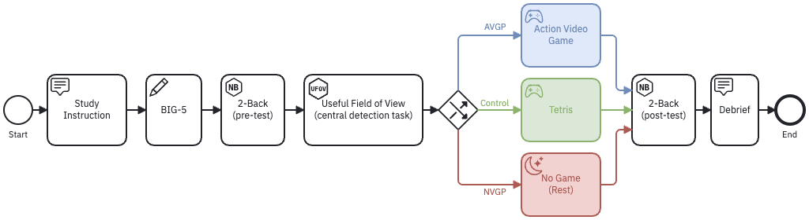

Studyflows are BPMN-based diagrams to describe research workflows. They can be used to visually describe the study protocol, data collection, analysis pipeline, or any other steps in a study. Studyflows facilitate communication with participants (e.g., by automatically running a study), researchers (e.g., by reproducible protocols and analyses), systems (e.g., by automated data processing), and other stakeholders.

Here is an example of a simple studyflow:

{width="80%" .lightbox}

Although studyflows are visual, the underlying storage format is machine-readable. This allows for automated execution, validation, versioning, and simulation of studyflows. Studyflows can be created using diagramming tools such as [Studyflow Modeler](https://behaverse.org/studyflow-modeler).

## The two studyflow files in a dataset

A studyflow describes what a study *intends* to happen; a dataset also has to record what *actually* happened to each agent. BDM therefore stores two related files:

`studyflow.xml`
: The study design, at the root of the dataset. It defines the activities and the paths agents may take through them, in the BPMN-based format described above, and is what the [Studyflow Modeler](https://behaverse.org/studyflow-modeler) produces. One file per dataset, since the design is shared by everyone in the study.

`studyflow.csv`
: What actually happened for one agent, at the root of that agent's folder (`data/agent_001/studyflow.csv`). One file per agent, because each agent traverses the design differently.

Together they make an agent's path auditable: the design states what was possible, and the per-agent record states which of it occurred.

## The run log (`studyflow.csv`)

`studyflow.csv` is the **run log**: one row per *activity run*, where a run is a single execution of one activity by one agent. Restarting an activity produces another run, and therefore another row. It is defined by the `Studyflow` table of the trial schema—see the [field-by-field reference](/spec/trial/01-studyflowlog.qmd).

Each row records:

- **which run it was**—`runtime_id`, the identifier every other table uses to refer back to this run, together with `attempt`, `instrument_repetition`, and `timeline_repetition`;
- **where it sits in the study**—`agent_id`, `session_index`, `session_uuid`, `activity_index`, `instrument_id`, and `timeline_id`;
- **how it went**—`status` and, where relevant, `abandon_reason`;
- **when it happened**—`start_datetime`, `end_datetime`, and `anchor_datetime`, the point that ties the run's monotonic clock to wall-clock time.

Because a run that was started and abandoned before producing any data still gets a row, the run log is what makes incomplete participation visible. A dataset's data files show only the runs that produced data; `studyflow.csv` shows every run that was begun, which is what tells a reader whether a missing activity was skipped, abandoned, or never assigned.

`runtime_id` is also what makes local identifiers unambiguous. Identifiers such as `response_id` are unique only *within* a run, so the dataset-wide key for a row is the pair `(runtime_id, response_id)`.

::: {.callout-note appearance="simple" icon="false"}
**See also**

- [Studyflow Modeler](https://behaverse.org/studyflow-modeler): visual editor for studyflow diagrams.
- [Studyflow Specification](https://behaverse.org/studyflow-modeler/docs/): complete list of supported elements and their attributes.
:::
